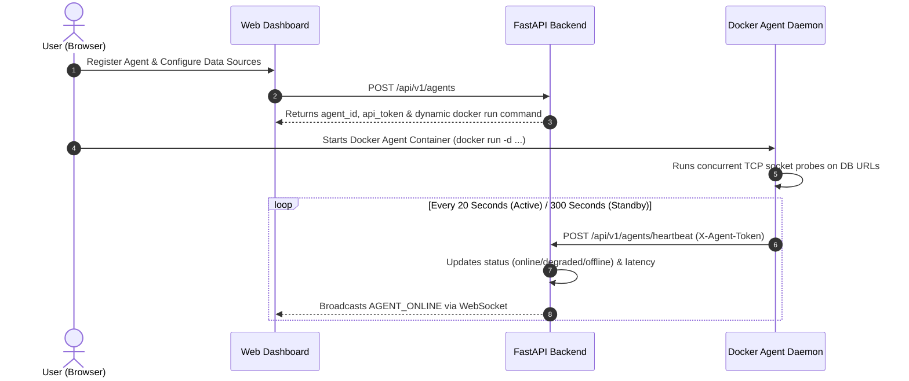
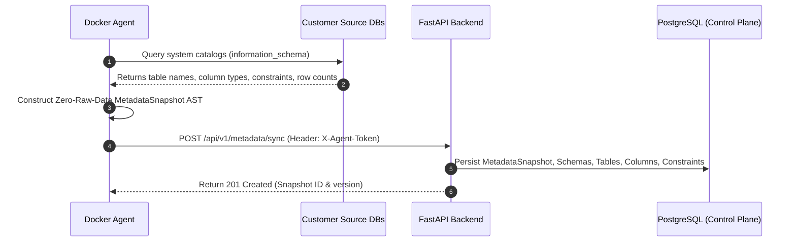
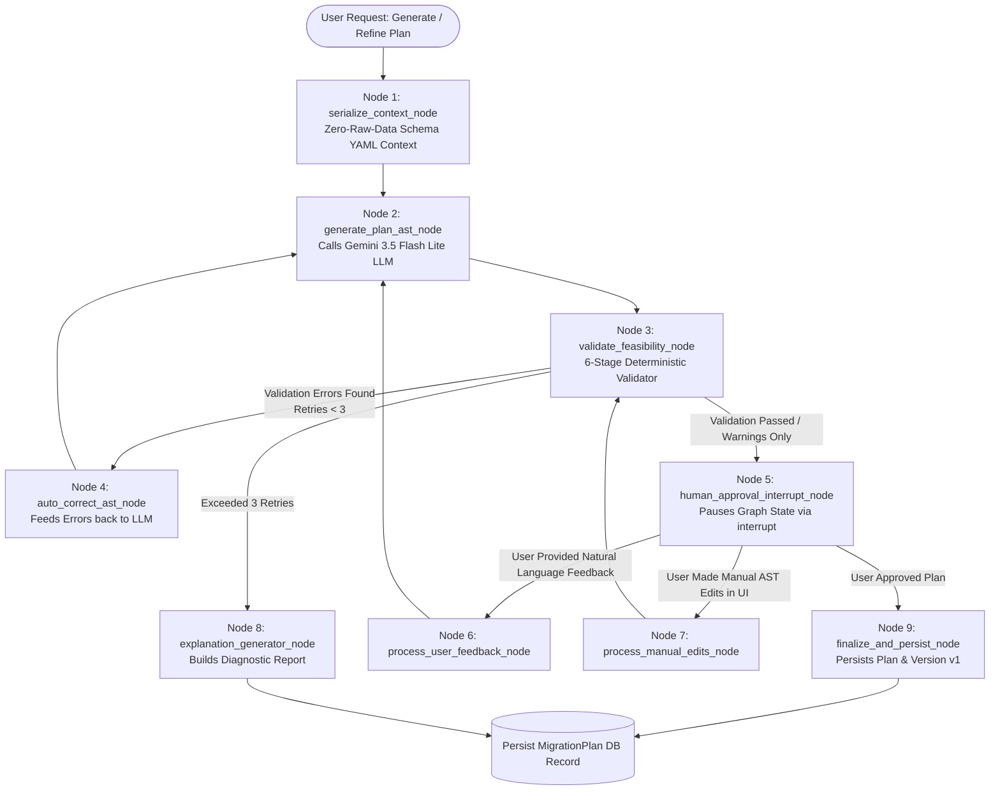
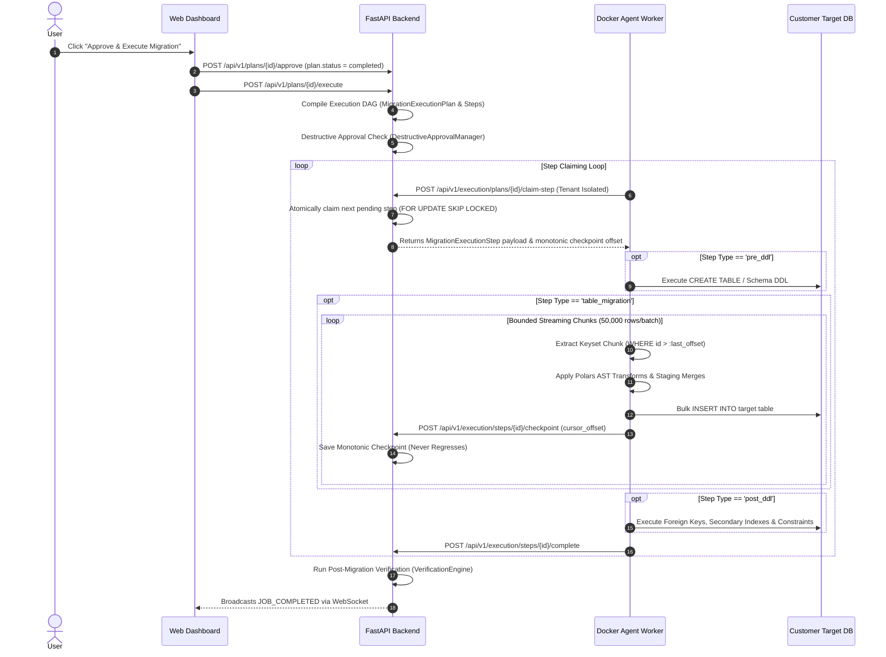
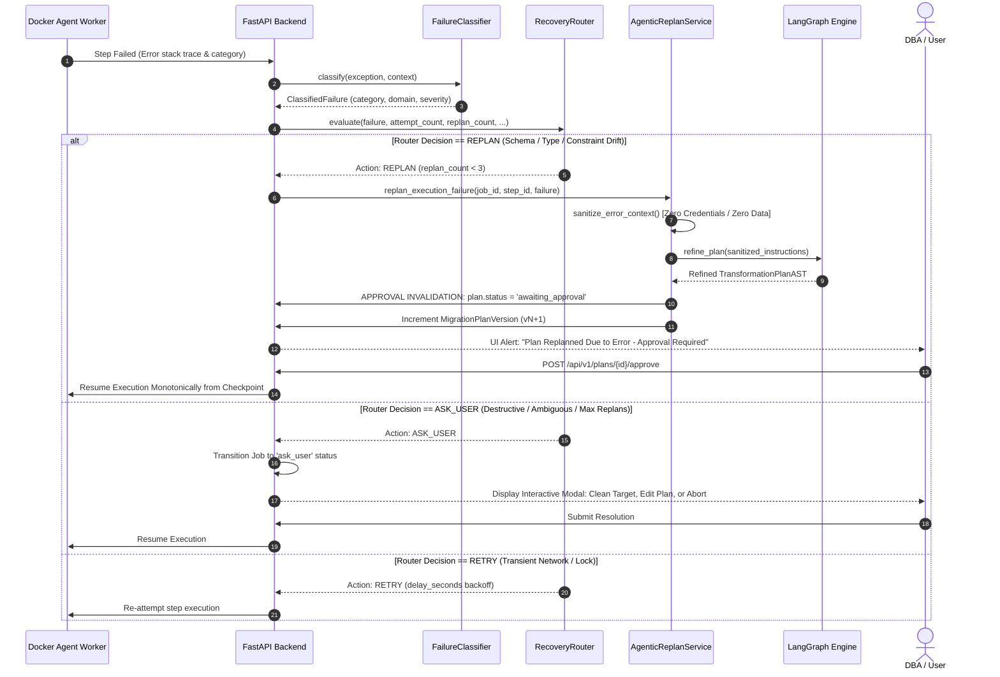

# Architecture Specification — Migraflow Platform

Welcome to the **Migraflow** architecture guide! This document provides a comprehensive, implementation-accurate overview of the platform's architectural principles, components, module responsibilities, end-to-end execution flows, and communication protocols.

---

## 1. Core Architectural Philosophy

The platform decouples **transformation reasoning (Control Plane)** from **transformation execution (Data Plane)** under a strict **Zero Raw Data Ingestion Policy**.

```text
 ┌────────────────────────────────────────────────────────────────────────────────────────┐
 │                              CONTROL PLANE (Cloud / Backend API)                       │
 │                                                                                        │
 │   ┌──────────────────────┐      ┌─────────────────────────┐      ┌──────────────────┐  │
 │   │  Web UI (Next.js)    │ <──> │  FastAPI Backend API    │ <──> │  PostgreSQL DB   │  │
 │   │  (Visual Blueprint,  │ (WS) │  (Auth, Metadata Store, │      │  (Control Plane  │  │
 │   │   Progress & HITL)   │      │   LangGraph Engine)     │      │   Metadata Only) │  │
 │   └──────────────────────┘      └────────────┬────────────┘      └──────────────────┘  │
 └──────────────────────────────────────────────┼─────────────────────────────────────────┘
                                                │ HTTPS REST API
                                                │ (X-Agent-Token Authentication)
                                                │ *ZERO Raw Customer Data Ever Transferred*
 ┌──────────────────────────────────────────────┼─────────────────────────────────────────┐
 │                                              ▼                                         │
 │                               ON-PREMISE DATA PLANE (Customer VPC)                     │
 │                                                                                        │
 │   ┌────────────────────────────────────────────────────────────────────────────────┐   │
 │   │                         Docker Agent Daemon (apps/agent)                       │   │
 │   │                                                                                │   │
 │   │   ┌───────────────────────────────┐     ┌──────────────────────────────────┐   │   │
 │   │   │  AgentMetadataEngine          │     │  ExecutionOrchestrator           │   │   │
 │   │   │  (Catalog Introspection:      │     │  (Chunked ETL, Polars AST        │   │   │
 │   │   │   Postgres, MySQL, MongoDB)   │     │   Transforms, Bulk Loader)       │   │   │
 │   │   └──────────────┬────────────────┘     └────────────────┬─────────────────┘   │   │
 │   └──────────────────┼───────────────────────────────────────┼─────────────────────┘   │
 │                      ▼                                       ▼                         │
 │           ┌──────────────────────┐                ┌──────────────────────┐             │
 │           │   Source Databases   │                │   Target Database    │             │
 │           │ (Postgres, MySQL, …) │                │ (Postgres, MySQL, …) │             │
 │           └──────────────────────┘                └──────────────────────┘             │
 └────────────────────────────────────────────────────────────────────────────────────────┘
```

### Key Architectural Pillars:

1. **Zero Raw Data Ingestion**:
   - Customer records **never** leave the customer's local infrastructure or VPC.
   - The Control Plane only receives sanitized structural metadata ASTs (schema names, table definitions, column types, row count estimates, constraints, and foreign keys).

2. **Deterministic Execution (No Dynamic Code Eval)**:
   - AI models (Gemini 3.5 Flash Lite) are used **strictly** to reason about schema semantics and output a strongly typed Abstract Syntax Tree (`TransformationPlanAST`).
   - ETL execution is 100% deterministic (powered by Polars, SQLAlchemy, and DuckDB). Dynamic evaluation (`eval()`, `exec()`, arbitrary Python code execution) is strictly forbidden.

3. **Stateful Human-in-the-Loop (HITL) Reasoning**:
   - Migration plans require explicit human review and approval before execution can be scheduled.
   - Users can provide natural language refinement prompts or manually edit column mappings, triggering deterministic re-validation through LangGraph.

4. **Resumable Chunked Streaming & Bounded-Memory Merges**:
   - Data extraction and target loading stream in bounded memory chunks (50,000 rows per batch) with source-scoped checkpoint state persistence (`checkpoint_{job_id}_{target_table}_{source_identifier}_{source_table}.json`). If an agent crashes or restarts, migration resumes seamlessly from the exact source offset without duplicate inserts.
   - Multi-source table merges stage intermediate chunks into a local DuckDB file database (`staging_{job_id}_{target_table}.duckdb`) on disk, streaming deduplicated final batches in bounded memory to prevent Out-Of-Memory (OOM) failures.

---

## 2. System Components & Folder Breakdown

The repository is organized as a modular, multi-package enterprise architecture:

```text
ai-data-migration-platform/
├── apps/
│   ├── api/                     # Control Plane Backend (FastAPI, LangGraph, PostgreSQL)
│   │   ├── alembic/             # Database schema migrations (001 through 018)
│   │   ├── app/
│   │   │   ├── core/            # Config, DB connections, Redis, WebSockets, Logging
│   │   │   └── modules/
│   │   │       ├── users/       # Auth, JWT, Google OAuth 2.0, Password Reset (Redis TTL)
│   │   │       ├── agents/      # Agent lifecycle, tokens, heartbeat & docker run generator
│   │   │       ├── sources/     # Logical Data Sources registry per agent
│   │   │       ├── metadata/    # Schema snapshot catalog & sync endpoints
│   │   │       ├── migration_plans/ # LangGraph 9-Node Engine, Gemini LLM, Validator & Plan Versions
│   │   │       ├── execution/   # Two-Tier Execution DAG, State Machine, Router, Checkpoints & Safety
│   │   │       ├── observability/ # ExecutionTracer, LLMTracker, BudgetManager, Spans & Health
│   │   │       └── evaluation/  # Synthetic Benchmark Suite, Quality Gates, Evaluators & Failure Injection
│   │   ├── tests/               # Unit, integration, concurrency, and security test suites
│   │   └── pyproject.toml       # Python 3.11+ dependencies managed via Poetry
│   │
│   ├── agent/                   # On-Premise Docker Agent (Data Plane Runner)
│   │   ├── main.py              # Agent daemon: socket diagnostics, dynamic heartbeats, job polling
│   │   ├── metadata_engine.py   # Native SQL catalog introspection engine (Zero Raw Data)
│   │   ├── engine/              # Modular ETL Execution Engine Package:
│   │   │   ├── orchestrator.py  # Central ExecutionOrchestrator driving the ETL pipeline
│   │   │   ├── connectors/      # SourceConnectorFactory (PostgreSQL, MySQL, MongoDB, Keyset pagination)
│   │   │   ├── transformers/    # ASTTransformer (Polars expressions, type casting, PK strategies)
│   │   │   ├── staging/         # TableMerger & DuckDB persistent staging for multi-source joins
│   │   │   ├── writers/         # TargetWriterFactory (PostgreSQL, MySQL, MongoDB, SQLite bulk insert)
│   │   │   ├── ddl/             # DDLExecutor (Pre/post migration DDL, constraint/index management)
│   │   │   ├── checkpoint.py    # CheckpointManager (source-scoped offset tracking & crash recovery)
│   │   │   ├── db.py            # Cached SQLAlchemy engines (_get_engine, dispose_all_engines)
│   │   │   └── progress_reporter.py # Throttled HTTPS progress reporting to Control Plane
│   │   ├── execution_engine.py  # Backward-compatible re-export facade of ExecutionOrchestrator
│   │   ├── Dockerfile           # Hardened non-root Python runtime container for customer deployment
│   │   └── pyproject.toml       # Agent dependencies (Polars, DuckDB, SQLAlchemy, PyMySQL, psycopg2)
│   │
│   └── web/                     # Web UI Frontend (Next.js 14, React, TailwindCSS / CSS)
│
├── docs/                        # Architecture & system specifications
├── DECISIONS.md                 # Architecture Decision Records (ADRs)
└── EXECUTION_FLOW.md            # Detailed function-level call trees & state machines
```

---

## 3. Detailed Module Responsibilities

### 3.1 Control Plane Backend (`apps/api/app/modules/`)

| Module | Primary Responsibility | Key Files |
| :--- | :--- | :--- |
| **`users`** | Handles user registration, password hashing (bcrypt), JWT session cookies, Google OAuth 2.0 authentication, and Redis-backed 5-minute single-use password reset tokens with 60-second rate-limiting cooldowns. | `users_routes.py`, `users_services.py`, `users_models.py` |
| **`agents`** | Manages Docker Agent identity, generates secure SHA-256 API tokens, receives dynamic heartbeat diagnostics (20s active / 300s standby), handles emergency fatal error reports (`POST /api/v1/agents/fatal-error`), and dynamically builds custom `docker run` commands with pre-filled environment variables. | `agents_routes.py`, `agents_services.py`, `agents_command_generator.py` |
| **`sources`** | Registers logical data sources (PostgreSQL, MySQL, MongoDB) attached to an agent and tracks live connectivity health. | `sources_routes.py`, `sources_services.py`, `sources_models.py` |
| **`metadata`** | Ingests structural metadata snapshots from agents (`POST /api/v1/metadata/sync`), persisting versioned tables, columns, constraints, and relationships under strict Zero-Raw-Data guarantees. | `metadata_routes.py`, `metadata_services.py`, `metadata_models.py` |
| **`migration_plans`** | Houses the **LangGraph 9-Node Agent Engine**, **Gemini 3.5 Flash Lite prompt generator**, **6-Stage Migration Feasibility Validator**, and **Immutable Plan Versioning Engine** (`GET /versions`, `POST /restore`). Coordinates plan generation, natural language feedback refinement, approval gating, and triggers closed-loop self-healing upon runtime failures. | `migration_plans_graph.py`, `migration_plans_llm.py`, `migration_plans_validator.py`, `migration_plans_ast.py`, `migration_plans_services.py` |
| **`execution`** | Orchestrates the **Two-Tier Execution DAG** (`MigrationExecutionPlan`, `MigrationExecutionStep`), strict state machine (`ExecutionStateMachine`), tenant-isolated atomic step claiming (`FOR UPDATE SKIP LOCKED`), monotonic database checkpointing (`MigrationStepCheckpoint`), failure classification (`FailureClassifier`), deterministic recovery decisions (`RecoveryRouter`), closed-loop replanning (`AgenticReplanService`), destructive safety approvals (`DestructiveApprovalManager`), and multi-tier post-migration data verification (`VerificationEngine`). | `execution_routes.py`, `execution_services.py`, `execution_models.py`, `execution_plan_services.py`, `execution_state_machine.py`, `failure_taxonomy.py`, `recovery_router.py`, `agentic_replan_services.py`, `safety_services.py`, `verification_services.py` |
| **`observability`** | Provides comprehensive distributed tracing (`ExecutionTracer`), OpenTelemetry-compatible span recording (`TraceSpan`), LLM token tracking (`LLMTracker`), and real-time execution budget enforcement (`BudgetManager`) with dollar-denominated cost tracking per model family. | `tracer.py`, `llm_tracker.py`, `budget_manager.py`, `health_service.py`, `metrics_service.py`, `structured_logger.py`, `observability_models.py` |
| **`evaluation`** | Automated regression benchmarking harness (`EvaluationService`). Evaluates AI migration plans across 15 synthetic real-world edge-case scenarios using multi-dimensional evaluators (`PlanningEvaluator`, `RecoveryEvaluator`, `LLMOutputEvaluator`), enforces measurable quality gates (`QualityGateValidator`), and simulates operational faults via `FailureInjectionSimulator`. | `evaluation_service.py`, `evaluation_dataset.py`, `quality_gates.py`, `evaluator_planning.py`, `evaluator_recovery.py`, `evaluator_llm_output.py`, `failure_injection.py`, `evaluation_models.py` |

---

### 3.2 On-Premise Docker Agent (`apps/agent/`)

| Component | Responsibility |
| :--- | :--- |
| **`main.py`** | Agent daemon process. Runs startup multi-threaded TCP socket connectivity tests against configured database URLs (`SRC_*_URL`, `DEST_*_URL`), runs dynamic background heartbeat loop with adaptive pacing (20s active vs 300s standby), responds to backend control directives (`ENTER_IDLE_MODE`, `RESUME_ACTIVE_MODE`, `SHUTDOWN`), reports container fatal stopping errors via emergency endpoint, triggers schema introspection, and polls for pending execution jobs (`GET /api/v1/agents/tasks`). |
| **`metadata_engine.py`** (`AgentMetadataEngine`) | Queries native database system catalogs (`information_schema.tables`, `information_schema.columns`, `table_constraints`, `pg_class`, `sqlite_master`) without reading user data rows. Builds structured JSON snapshot payloads and syncs via `POST /api/v1/metadata/sync`. |
| **`engine/orchestrator.py`** (`ExecutionOrchestrator`) | Central ETL execution pipeline orchestrator. Coordinates pre-migration DDL, source stream reading, Polars transformations, multi-source DuckDB staging merges, target loading, monotonic checkpoint commits, post-migration DDL, and connection pool cleanup via `dispose_all_engines()`. |
| **`engine/connectors/source_factory.py`** (`SourceConnectorFactory`) | Reads source data in 50,000-row streaming chunks with SQL keyset pagination (`WHERE id > :last_id ORDER BY id LIMIT :chunk_size`) and MongoDB `_id` pagination. Wraps database connection drops in descriptive `SourceReadError`. |
| **`engine/transformers/ast_transformer.py`** (`ASTTransformer`) | Applies in-memory Polars transformations: strict type casting with zero timestamp fabrication, 4 PK strategies (`keep_original`, `autoincrement_offset`, `prefix_id`, `uuid_v4_rekey`), column renames, and residual unmapped field capture into `extra_attributes` JSON. |
| **`engine/staging/duckdb_staging.py`** (`TableMerger`) | Merges multi-source tables via bounded-memory DuckDB local staging files (`staging_{job_id}_{target_table}.duckdb`). Preserves staging state across container crashes and streams deduplicated final chunks directly to target writer. |
| **`engine/writers/target_writer.py`** (`TargetWriterFactory`) | Performs high-performance bulk insertions with fast (<3s) proactive connectivity pre-checks (`engine.connect()`), rowcount conflict verification, and PyMongo `BulkWriteError` handling. |
| **`engine/checkpoint.py`** (`CheckpointManager`) | Persists row offsets locally per table and per source (`checkpoint_{job_id}_{target_table}_{source_id}_{source_table}.json`) and syncs to control-plane `migration_step_checkpoints` for crash resilience and one-click resumption. |
| **`engine/db.py`** | Centralized database connection engine cache (`_get_engine(url)`) with explicit disposal (`dispose_all_engines()`) to prevent connection pool exhaustion and file lock leaks. |
| **`engine/progress_reporter.py`** (`ProgressReporter`) | Throttled HTTPS progress reporter sending processed rows, throughput metrics, and error stack traces to the Control Plane. |

---

## 4. End-to-End Application Workflows

### 4.1 Workflow 1: Agent Setup & Live Diagnostic Heartbeats


```mermaid
sequenceDiagram
    autonumber
    actor User as User (Browser)
    participant UI as Web Dashboard
    participant API as FastAPI Backend
    participant Agent as Docker Agent Daemon

    User->>UI: Register Agent & Configure Data Sources
    UI->>API: POST /api/v1/agents
    API-->>UI: Returns agent_id, api_token & dynamic docker run command
    User->>Agent: Starts Docker Agent Container (docker run -d ...)
    Agent->>Agent: Runs concurrent TCP socket probes on DB URLs
    loop Every 20 Seconds (Active) / 300 Seconds (Standby)
        Agent->>API: POST /api/v1/agents/heartbeat (X-Agent-Token)
        API->>API: Updates status (online/degraded/offline) & latency
        API-->>UI: Broadcasts AGENT_ONLINE via WebSocket
    end
```

---

### 4.2 Workflow 2: Zero-Raw-Data Schema Introspection


```mermaid
sequenceDiagram
    autonumber
    participant Agent as Docker Agent
    participant DB as Customer Source DBs
    participant API as FastAPI Backend
    participant DBStore as PostgreSQL (Control Plane)

    Agent->>DB: Query system catalogs (information_schema)
    DB-->>Agent: Returns table names, column types, constraints, row counts
    Agent->>Agent: Construct Zero-Raw-Data MetadataSnapshot AST
    Agent->>API: POST /api/v1/metadata/sync (Header: X-Agent-Token)
    API->>DBStore: Persist MetadataSnapshot, Schemas, Tables, Columns, Constraints
    API-->>Agent: Return 201 Created (Snapshot ID & version)
```

---

### 4.3 Workflow 3: AI Migration Plan Generation & Feasibility Validation (LangGraph)

When the user requests AI plan generation (`POST /api/v1/plans/generate`), the request executes through the stateful **LangGraph StateGraph** (`migration_plans_graph.py`):


```mermaid
flowchart TD
    Start([User Request: Generate / Refine Plan]) --> N1[Node 1: serialize_context_node<br>Zero-Raw-Data Schema YAML Context]
    N1 --> N2[Node 2: generate_plan_ast_node<br>Calls Gemini 3.5 Flash Lite LLM]
    N2 --> N3[Node 3: validate_feasibility_node<br>6-Stage Deterministic Validator]
    
    N3 -->|Validation Errors Found<br>Retries < 3| N4[Node 4: auto_correct_ast_node<br>Feeds Errors back to LLM]
    N4 --> N2
    
    N3 -->|Exceeded 3 Retries| N8[Node 8: explanation_generator_node<br>Builds Diagnostic Report]
    
    N3 -->|Validation Passed / Warnings Only| N5[Node 5: human_approval_interrupt_node<br>Pauses Graph State via interrupt]
    
    N5 -->|User Provided Natural Language Feedback| N6[Node 6: process_user_feedback_node]
    N6 --> N2
    
    N5 -->|User Made Manual AST Edits in UI| N7[Node 7: process_manual_edits_node]
    N7 --> N3
    
    N5 -->|User Approved Plan| N9[Node 9: finalize_and_persist_node<br>Persists Plan & Version v1]
    N9 --> Persist[(Persist MigrationPlan DB Record)]
    N8 --> Persist
```

#### The 6-Stage Feasibility Validator Checks:
1. **Stage 0 (Empty Mappings Check)**: Validates that `table_mappings` contains at least 1 table mapping; fails if empty.
2. **Stage A (Source Table & Schema Existence Check)**: Verifies all referenced source database aliases and tables exist in snapshot metadata.
3. **Stage B (Source Column & Type Conversion Check)**: Verifies source columns exist, checks type compatibility, enforces **Target Column Collision Checks**, and performs **Concatenation Length-Overflow Checks**.
4. **Stage C (Primary Key & Deduplication Key Validity Check)**: Ensures deduplication keys map to valid target columns and validates primary key generation strategies.
5. **Stage D (Foreign Key & DDL Two-Phase Hygiene & Pre-DDL Resolution Check)**: Enforces that foreign keys execute in `post_migration_ddl` after data streaming completes. Automatically parses `CREATE TABLE` DDL statements in `pre_migration_ddl` to register newly created target tables in the validation set.
6. **Stage D2 (Circular Foreign Key Cycle Detection Check)**: Constructs a directed graph of post-migration foreign key dependencies and runs DFS cycle detection, emitting architecture warning notices when circular FK cycles are detected.
7. **Stage E (Architecture Standards & PK Rekey Remap Warnings)**: Checks lowercase `snake_case` naming conventions and warns when multi-source table merges rekey primary keys while foreign key dependent tables exist.

---

### 4.4 Workflow 4: Two-Tier DAG Execution, Monotonic Checkpoints & Step Claiming

Migraflow compiles approved blueprints into a fine-grained **Two-Tier Execution DAG** consisting of a `MigrationExecutionPlan` containing ordered `MigrationExecutionStep` entities (`pre_ddl`, `table_migration`, `post_ddl`, `verification`):


```mermaid
sequenceDiagram
    autonumber
    actor User as User
    participant UI as Web Dashboard
    participant API as FastAPI Backend
    participant Agent as Docker Agent Worker
    participant TargetDB as Customer Target DB

    User->>UI: Click "Approve & Execute Migration"
    UI->>API: POST /api/v1/plans/{id}/approve (plan.status = completed)
    UI->>API: POST /api/v1/plans/{id}/execute
    API->>API: Compile Execution DAG (MigrationExecutionPlan & Steps)
    API->>API: Destructive Approval Check (DestructiveApprovalManager)
    
    loop Step Claiming Loop
        Agent->>API: POST /api/v1/execution/plans/{id}/claim-step (Tenant Isolated)
        API->>API: Atomically claim next pending step (FOR UPDATE SKIP LOCKED)
        API-->>Agent: Returns MigrationExecutionStep payload & monotonic checkpoint offset
        
        opt Step Type == 'pre_ddl'
            Agent->>TargetDB: Execute CREATE TABLE / Schema DDL
        end
        
        opt Step Type == 'table_migration'
            loop Bounded Streaming Chunks (50,000 rows/batch)
                Agent->>Agent: Extract Keyset Chunk (WHERE id > :last_offset)
                Agent->>Agent: Apply Polars AST Transforms & Staging Merges
                Agent->>TargetDB: Bulk INSERT INTO target table
                Agent->>API: POST /api/v1/execution/steps/{id}/checkpoint (cursor_offset)
                API->>API: Save Monotonic Checkpoint (Never Regresses)
            end
        end
        
        opt Step Type == 'post_ddl'
            Agent->>TargetDB: Execute Foreign Keys, Secondary Indexes & Constraints
        end
        
        Agent->>API: POST /api/v1/execution/steps/{id}/complete
    end
    
    API->>API: Run Post-Migration Verification (VerificationEngine)
    API-->>UI: Broadcasts JOB_COMPLETED via WebSocket
```

---

### 4.5 Workflow 5: Closed-Loop AI Failure Classification, Self-Healing & Agentic Replanning

When an unexpected database error occurs at runtime, Migraflow avoids blind retries. Instead, it classifies the failure, evaluates operational bounds, sanitizes the diagnostic context, and triggers an autonomous replan cycle via LangGraph:


```mermaid
sequenceDiagram
    autonumber
    participant Agent as Docker Agent Worker
    participant API as FastAPI Backend
    participant Classifier as FailureClassifier
    participant Router as RecoveryRouter
    participant Replan as AgenticReplanService
    participant LangGraph as LangGraph Engine
    actor User as DBA / User

    Agent->>API: Step Failed (Error stack trace & category)
    API->>Classifier: classify(exception, context)
    Classifier-->>API: ClassifiedFailure (category, domain, severity)
    
    API->>Router: evaluate(failure, attempt_count, replan_count, ...)
    
    alt Router Decision == REPLAN (Schema / Type / Constraint Drift)
        Router-->>API: Action: REPLAN (replan_count < 3)
        API->>Replan: replan_execution_failure(job_id, step_id, failure)
        Replan->>Replan: sanitize_error_context() [Zero Credentials / Zero Data]
        Replan->>LangGraph: refine_plan(sanitized_instructions)
        LangGraph-->>Replan: Refined TransformationPlanAST
        Replan->>API: APPROVAL INVALIDATION: plan.status = 'awaiting_approval'
        Replan->>API: Increment MigrationPlanVersion (vN+1)
        API-->>User: UI Alert: "Plan Replanned Due to Error - Approval Required"
        User->>API: POST /api/v1/plans/{id}/approve
        API->>Agent: Resume Execution Monotonically from Checkpoint
    else Router Decision == ASK_USER (Destructive / Ambiguous / Max Replans)
        Router-->>API: Action: ASK_USER
        API->>API: Transition Job to 'ask_user' status
        API-->>User: Display Interactive Modal: Clean Target, Edit Plan, or Abort
        User->>API: Submit Resolution
        API->>Agent: Resume Execution
    else Router Decision == RETRY (Transient Network / Lock)
        Router-->>API: Action: RETRY (delay_seconds backoff)
        API->>Agent: Re-attempt step execution
    end
```

---

### 4.6 Workflow 6: Multi-Tier Post-Migration Verification & Quality Assurance

After data extraction and target loading finish, `VerificationEngine` runs multi-tier post-migration checks before declaring success:

1. **Row Count Parity Check**: Compares source row counts against destination table counts. Flags discrepancies exceeding tolerance thresholds.
2. **Primary Key Hash Consistency Check**: Verifies that primary key sets across source and target match 100% without orphaned records.
3. **Foreign Key Integrity Check**: Executes referential queries against target database catalogs to verify that all foreign keys reference valid parent records.
4. **Verification Result Persistence**: Results are persisted in `step_verification_results` and surfaced in the Web UI dashboard with pass/fail badges.

---

## 5. Communication Protocols & Security Model

The platform is designed around a **Zero-Knowledge Security Architecture**, guaranteeing that database credentials and sensitive customer data never touch the cloud Control Plane, and that multi-agent communication is cryptographically secured and strictly isolated.

### 5.1 Communication Protocols Overview

| Channel | Protocol | Auth Mechanism | Payload / Purpose |
| :--- | :--- | :--- | :--- |
| **Agent ➔ Backend** | **HTTPS (REST)** | `X-Agent-Token` (SHA-256 hash verified) | Heartbeats, schema snapshots, job polling, ETL progress reports, monotonic checkpoints |
| **Backend ➔ Web UI** | **WebSockets (`wss://`)** | JWT Bearer Token | Real-time progress bars, stage transitions, agent online status, intervention requests |
| **Web UI ➔ Backend** | **HTTPS (REST)** | HTTP-only JWT Cookie (`access_token`) | CRUD operations, plan generation, HITL approval, destructive confirmations |
| **Agent ➔ Customer DBs** | **Native SQL TCP** | Local connection strings in Docker environment | Reading source rows, bulk writing target rows |

---

### 5.2 Enterprise Security & Hardening Controls

#### 1. Transport Layer Security (TLS / HTTPS)
All agent-to-backend traffic occurs strictly over encrypted **HTTPS (TLS 1.2 / TLS 1.3)**, preventing Man-in-the-Middle (MITM) attacks and token eavesdropping.

#### 2. Cryptographic Token Generation & One-Way Hashing
When an Agent is created, the Control Plane generates a cryptographically secure, 32-byte URL-safe API token (`ag_live_...`). **The backend never stores plaintext tokens**; only the one-way **SHA-256 hex digest** (`agents.api_token_hash`) is persisted. Verification occurs via constant-time SHA-256 comparison.

#### 3. Multi-Agent Cryptographic Isolation & Tenant Boundaries
- **Task Discovery**: When an agent polls `claim-step` or `/agents/tasks`, the backend filters strictly by the authenticated tenant and assigned agent.
- **Worker Failover**: Multi-agent worker failover is permitted within a user's fleet, but cross-tenant access is strictly blocked at the SQL query level.

#### 4. Zero-Knowledge Credential Architecture
- The Control Plane **never receives or stores customer database passwords**.
- Connection strings reside **exclusively in the customer's local Docker environment**. The Control Plane only stores non-sensitive logical identifiers (`src_postgres`, `dest_mysql`, engine types, and port numbers).

#### 5. Zero Raw Customer Data Transmission
- The agent sends only **sanitized structural metadata** (`information_schema` table names, column types, row count estimates) to the backend for AI reasoning.
- Customer rows, PII, and financial records **never leave the local Docker container runtime**.

#### 6. Agent Liveness Monitoring & Dynamic Heartbeats
- The agent sends diagnostic heartbeats every 20 seconds during active migrations, automatically throttling to a 300-second standby interval after 5 minutes of inactivity to conserve resources.

#### 7. Backend Stuck-Job Watchdog
- The Control Plane runs a background watchdog service (`check_stale_agents_and_jobs`) monitoring all active non-terminal states (`claimed`, `preparing`, `running`, `recovering`, `verifying`, `ask_user`). If an agent stops heartbeating for > 60 seconds, jobs transition to `failed` with descriptive `AGENT_DISCONNECTED` diagnostics.

#### 8. MongoDB Introspection, Majority-Vote Resolution & Residual Capture Guarantees
- Schemaless MongoDB collections are introspected by sampling up to 100 documents with recursive depth-3 path flattening. Dynamic field types are resolved via majority-vote BSON counting, and unmapped attributes are captured into an `extra_attributes` JSON column to prevent data loss.

#### 9. Dynamic Agent Heartbeat & Container Directives
- Backend responses to agent heartbeats include control directives (`ENTER_IDLE_MODE`, `RESUME_ACTIVE_MODE`, `SHUTDOWN`), coordinating power states and graceful container lifecycle events.

#### 10. Fast Target DB Connectivity Pre-Check & Engine Cache
- Proactive 3-second `engine.connect()` checks verify destination connectivity before chunk extraction begins. Database engines are pooled in `_ENGINE_CACHE` and safely closed via `dispose_all_engines()` in top-level `finally:` blocks.

#### 11. Multi-Source DuckDB Staging Merge Crash Resilience
- Multi-source table joins stage intermediate transformed chunks into a dedicated local DuckDB database (`staging_{job_id}_{target_table}.duckdb`). Upon container restart, already-staged sources are preserved, eliminating duplicate extraction.

#### 12. Immutable Plan Versioning & Historical Rollback Architecture
- Every plan lifecycle transition (initial generation, refinement prompts, manual UI edits, AI replanning) creates an immutable `MigrationPlanVersion` record containing a complete snapshot of the `TransformationPlanAST`. Users can inspect and restore previous blueprints at any time.

#### 13. Zero Timestamp Fabrication Policy
- Datetime parsing strictly yields `None` (SQL `NULL`) when encountering missing or unparseable date values, preventing silent fabrication of fake timestamps.

#### 14. Client-Side Zero-Credential Parameter Substitution Pipeline
- Database hostnames, port numbers, usernames, and database names entered in the setup wizard are substituted in browser memory (`dockerCommandUtils.ts`) and never transmitted over the network to the backend API.

#### 15. Instant Agent API Token Regeneration & Revocation
- Calling `POST /api/v1/agents/{id}/regenerate-token` immediately generates a fresh token and invalidates the previous hash, terminating any revoked container on its very next heartbeat.

#### 16. Dry Run Simulation Mode (Zero Target Mutation)
- Supports running complete end-to-end migrations in simulation mode (`is_dry_run = true`), extracting real data and testing Polars transformations while bypassing target DDL and bulk inserts.

#### 17. Target-State Pre-Execution Safety & 5-Factor Readiness Scoring
- Preflight inspection detects whether target tables already exist and contain data (`has_existing_data`), preventing accidental data overwrite. Displays a 5-vector readiness breakdown (Syntax, PK Coverage, Type Compatibility, Constraint Preservation, Target State).

#### 18. Monotonic Checkpointing & Non-Regressing Offsets
- In `ExecutionPlanService.save_checkpoint`, incoming checkpoint payloads are validated against the current recorded state. If network jitter or retransmissions deliver an out-of-order payload, the engine rejects any backward regression of `cursor_offset` or `rows_processed`.

#### 19. Destructive Operation Approval Gating (`DestructiveApprovalManager`)
- Operations that drop tables, truncate existing target data, or alter existing primary keys require explicit human confirmation. Any mutation to the plan AST (manual edit or AI replan) immediately revokes all prior approvals (`plan.approved_version_number = None`, `plan.status = 'awaiting_approval'`).

#### 20. Non-Root Container Execution & Multi-Stage Production Hardening
- All production Dockerfiles enforce non-root execution:
  - `apps/api/Dockerfile`: `USER appuser` (UID 10001)
  - `apps/agent/Dockerfile`: `USER agentuser` (UID 10001)
  - `apps/web/Dockerfile`: `USER node` (UID 1000)
- Containers run with dropped root capabilities, read-only root filesystems where applicable, and explicit resource constraints (`deploy.resources.limits`) in `docker-compose.yml`.

---

## 6. Observability, Distributed Tracing & Cost Budgets

Migraflow incorporates enterprise observability across both local agent runtimes and cloud control-plane components:

### 6.1 Execution Tracer & OpenTelemetry Spans (`ExecutionTracer`)
- Records structured execution spans into the `trace_spans` and `execution_traces` tables.
- Traces span from the initial HTTP request, through LangGraph planning nodes, DAG step dispatch, chunked extraction, Polars transformation, and target loading.
- Native integration with **LangSmith** via environment variables (`LANGCHAIN_TRACING_V2=true`, `LANGCHAIN_PROJECT="Data migration platform"`).

### 6.2 LLM Call Tracking & Cost Accounting (`LLMTracker`)
- Tracks prompt tokens, completion tokens, model names, latency (ms), and estimated USD cost for every LLM interaction.
- Computes costs based on official provider pricing tables for Gemini, OpenAI, and Anthropic model families.

### 6.3 Budget Management & Quota Enforcement (`BudgetManager`)
- Allows organizations to set execution budgets (`ExecutionBudget`) per migration job or workspace.
- Enforces cost ceilings and emits warnings when token expenditures cross 80% and 100% budget thresholds.

---

## 7. AI Evaluation, Regression Benchmarking & Quality Gates

To prevent regressions in AI plan generation, prompt adjustments, or schema mapping logic, Migraflow includes an automated synthetic evaluation engine:

### 7.1 Synthetic Benchmark Scenarios (15 Edge-Case Test Suite)
The evaluation suite (`EvaluationDataset`) contains 15 curated real-world edge cases evaluated against synthetic database schemas (zero customer data):
1. Simple 1:1 table migration
2. Multi-source table join and merge
3. Complex data type casting (UUID, JSONB, Arrays)
4. Missing primary key synthetic UUID generation
5. Conflicting column name resolution
6. Differing primary key schema harmonization
7. Nullable vs. NOT NULL constraint mismatch
8. Duplicate record deduplication strategies
9. Foreign key topological dependency ordering
10. In-flight schema drift detection
11. Missing source table deterministic rejection
12. Unsupported spatial/geometric data type detection and text fallback
13. Complex SQL expression transformation requirement
14. Destructive target operation safety classification and approval requirement
15. Ambiguous mapping and confidence calibration

### 7.2 Multi-Dimensional Evaluators
- **`PlanningEvaluator`**: Measures 8 engineering dimensions including schema correctness, constraint correctness, validation accuracy, unsupported operation detection, and unnecessary transformation penalties.
- **`RecoveryEvaluator`**: Validates deterministic recovery routing and ensures circuit breaker bounds (`MAX_REPLANS_PER_JOB`, `MAX_RETRIES_PER_STEP`) are strictly enforced.
- **`LLMOutputEvaluator`**: Measures strict Pydantic JSON conformance, validation failure rates, and self-correction success rates.

### 7.3 Production Quality Gates (`QualityGateValidator`)
Deployments and model prompt updates must pass strict, non-negotiable engineering gates:
- **Deterministic Validation Pass Rate**: $\ge 95\%$
- **Critical Safety Violations**: $0$
- **Credential Leakage**: $0$
- **Unhandled Execution States**: $0$
- **Recovery Routing Accuracy**: $\ge 90\%$
- **LLM Output AST Validity**: $\ge 95\%$

---

## 8. Database Migrations (Alembic)

The Control Plane database schema is versioned using 18 sequential Alembic migrations in `apps/api/alembic/versions/`:

- `001_initial_control_plane_schema.py`: Initial users, connections, plans, jobs, metadata catalog.
- `002_add_agents_and_agent_relationships.py`: Agent entities and data source relationships.
- `003_add_google_auth_to_users.py`: Google OAuth 2.0 fields on `users`.
- `004_update_database_architecture_agent_centric.py`: Decouples connections into Agent-centric `data_sources` and N:M `migration_plan_snapshots`.
- `005_add_agent_tokens_and_datasource_diagnostics.py`: Agent API token hashing and connection diagnostics (`last_error`, `status`).
- `006_add_feasibility_and_langgraph_to_plans.py`: Adds `is_valid`, `validation_errors`, and `langgraph_thread_id` to `migration_plans`.
- `007_add_ai_diagnosis_to_migration_jobs.py`: Adds `ai_diagnosis` JSON column to `migration_jobs` for automated root-cause failure analysis.
- `008_add_migration_plan_versions.py`: Creates `migration_plan_versions` table and adds `current_version` integer to `migration_plans`.
- `009_add_idle_since_to_agents.py`: Adds `idle_since` timestamp column to `agents` for dynamic heartbeat standby tracking.
- `010_add_error_fields_to_agents.py`: Adds `last_error`, `error_category`, and `last_error_at` diagnostic columns to `agents`.
- `011_add_is_dry_run_to_migration_jobs.py`: Adds `is_dry_run` boolean column (default `false`) to `migration_jobs` to track dry-run simulation executions.
- `012_add_truncate_target_to_migration_jobs.py`: Adds `truncate_target` boolean column to `migration_jobs` for clean target wipes.
- `013_add_agent_runs_and_execution_events.py`: Creates `agent_runs` and `execution_events` tables for execution attempt tracking and granular event auditing.
- `014_add_execution_plans_steps_checkpoints.py`: Creates `migration_execution_plans`, `migration_execution_steps`, and `migration_step_checkpoints` tables for the Two-Tier Execution DAG.
- `015_add_failure_classification_interventions_and_governance.py`: Adds approval governance columns to `migration_plans`, failure classification columns to `migration_execution_steps`, and creates `destructive_approvals` table.
- `016_add_verification_and_safety_controls.py`: Creates `step_verification_results` table for post-migration data integrity checks.
- `017_add_observability_tracing_and_budgets.py`: Creates `execution_traces`, `trace_spans`, and `execution_budgets` tables for distributed tracing and LLM cost accounting.
- `018_add_evaluation_and_regression_testing.py`: Creates `evaluation_suite_runs` and `evaluation_scenario_results` tables for synthetic benchmark regression testing.

---

## 9. Summary for New Contributors

When contributing to Migraflow, adhere to the **Golden Engineering Rules**:
1. **Never read customer data in the Control Plane**: Only structural metadata ASTs and sanitized errors live in `apps/api`.
2. **Deterministic execution only**: Transformations must be declared as strongly typed Pydantic models in `migration_plans_ast.py` and executed deterministically in `apps/agent/engine/` using Polars and DuckDB. Dynamic code evaluation (`eval()`, `exec()`) is strictly prohibited.
3. **Always preserve HITL approval**: No migration step may execute without passing feasibility validation (`is_valid == True`) and receiving explicit human approval.
4. **Approval Invalidation on Plan Mutation**: Any modification to a plan AST—whether via user prompt, manual edit, or automated agentic replan—must revoke existing approvals and require fresh authorization.
5. **Monotonic Checkpoint Discipline**: Offsets must never regress backwards; out-of-order network checkpoints must be discarded.
6. **Connection Pool Discipline**: Always retrieve engines via `_get_engine(url)` in `engine/db.py` and invoke `dispose_all_engines()` in `finally:` blocks to prevent resource leaks.
7. **Zero Timestamp Fabrication**: Never substitute arbitrary fallback dates for unparseable dates; respect source schema nullability.
8. **Non-Root Docker Containers**: All Docker images must run under dedicated, unprivileged system users (`USER appuser`, `USER agentuser`, `USER node`).

