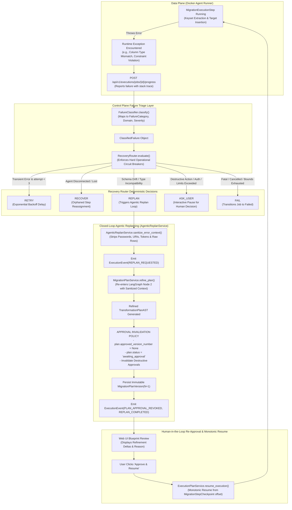

# LangGraph Stateful Agent Architecture Guide (`LANGGRAPH_ARCHITECTURE.md`)

This document provides a comprehensive architectural and operational guide for the **LangGraph Stateful Agent Planning, Feasibility Validation, and Closed-Loop Agentic Self-Healing Engine** powering Migraflow.

---

## 📐 1. System Vision & Architecture

Database migration planning is inherently **non-linear, iterative, stateful, and failure-prone**. A static, single-shot LLM prompt fails in production environments because:
1. **AI Output Uncertainty**: An initial LLM output may contain minor schema inaccuracies (e.g. referencing a column name that does not exist or proposing illegal type conversions).
2. **Deterministic Feasibility Guardrails**: LLMs lack native database catalog introspection. Feasibility validation must be **deterministic, multi-stage, and schema-backed** to guarantee zero data loss.
3. **Human-in-the-Loop (HITL) Direction**: Database administrators must be able to inspect blueprints, adjust column mappings, provide natural language instructions (*"drop password_hash and use left_join for db_2"*), or authorize destructive operations.
4. **Runtime Execution Feedback (Closed-Loop Self-Healing)**: In real-world enterprise databases, runtime extraction or loading can encounter unexpected schema drift, constraint violations, or database locks. The system must trap runtime execution errors, sanitize diagnostic context, and feed it back into LangGraph to autonomously replan or pause for human direction.

To fulfill these requirements, Migraflow couples **LangGraph** (`langgraph`) with a **Deterministic Recovery Decision Layer** and a **Two-Tier Execution DAG**, creating an autonomous, bounded, closed-loop migration lifecycle.

---

## 📊 2. Comprehensive LangGraph Architecture Diagrams

### 2.1 Pre-Execution Planning Engine (LangGraph StateGraph)

```mermaid
flowchart TD
    %% Ingress Layer
    subgraph Ingress["FastAPI Ingress Layer (migration_plans_routes.py)"]
        API_Gen["POST /api/v1/plans/generate"]
        API_Ref["POST /api/v1/plans/{id}/refine"]
        API_Edit["PUT /api/v1/plans/{id}"]
    end

    %% Service Orchestration
    API_Gen --> Service["MigrationPlanService"]
    API_Ref --> Service
    API_Edit --> Service

    Service --> StateInit["Initialize MigrationPlanState"]

    %% LangGraph Execution Engine
    subgraph LangGraph_Engine["LangGraph State Graph Engine (migration_plans_graph.py)"]
        StateInit --> N1["Node 1: serialize_context_node\n(Zero-Raw-Data Schema YAML Context)"]
        
        %% Context Serialization to AST Generation
        N1 --> N2["Node 2: generate_plan_ast_node\n(Gemini 3.5 Flash Lite LLM)"]
        
        %% AST Generation to Validation
        N2 --> N3["Node 3: validate_feasibility_node\n(5-Stage Deterministic Schema Checker)"]
        
        %% Conditional Routing: Check Feasibility
        N3 --> Cond1{"Router 1: check_validation_router\nis_valid?"}
        
        %% Path A: Validation Failed -> Auto Correction Loop
        Cond1 -->|False: Errors Detected & attempt < 3| N4["Node 4: auto_correct_ast_node\n(Feeds Errors back to LLM)"]
        N4 -->|Re-generate AST with Error Feedback| N2
        
        Cond1 -->|False: Retries Exceeded (attempt >= 3)| N8["Node 8: explanation_generator_node\n(Builds Detailed Feasibility Failure Report)"]
        
        %% Path B: Validation Passed -> Human-in-the-Loop Interrupt
        Cond1 -->|True: Schema Valid| N5["Node 5: human_approval_interrupt_node\n(PAUSES GRAPH STATE via interrupt())"]
        
        %% Human Feedback Routing
        N5 --> CondHuman{"Router 2: human_feedback_router\nUser Action?"}
        
        CondHuman -->|User Approved Plan| N9["Node 9: finalize_and_persist_node\n(Persists MigrationPlan & MigrationPlanVersion v1)"]
        
        CondHuman -->|Natural Language Feedback| N6["Node 6: process_user_feedback_node\n(Merges Feedback into State)"]
        N6 -->|Re-route to Refine Blueprint| N2
        
        CondHuman -->|Manual Structural UI Edits| N7["Node 7: process_manual_edits_node\n(Deep Identity Merge on AST)"]
        N7 -->|Re-validate Edited AST| N3
    end

    %% Persistence & UI Layer
    N8 --> ErrorResponse["Return HTTP 422 with Feasibility Failure Report"]
    N9 --> SuccessResponse["Return HTTP 201/200 with Verified MigrationPlan AST"]
    
    SuccessResponse --> UI["Web UI Frontend (Visual Blueprint & Execution Dashboard)"]
    ErrorResponse --> UI
```

---

### 2.2 Closed-Loop Runtime Self-Healing & Agentic Replanning Workflow

When execution begins, errors trapped by the Data Plane Worker Agent flow into the deterministic recovery pipeline. If a schema mismatch or constraint error occurs, `AgenticReplanService` sanitizes the context and re-triggers LangGraph refinement:


```mermaid
flowchart TD
    subgraph DataPlane["Data Plane (Docker Agent Runner)"]
        ExecStep["MigrationExecutionStep Running\n(Keyset Extraction & Target Insertion)"]
        ExecError["Runtime Exception Encountered\n(e.g., Column Type Mismatch, Constraint Violation)"]
        ExecStep -->|Throws Error| ExecError
        ExecError --> Reporter["POST /api/v1/executions/jobs/{id}/progress\n(Reports failure with stack trace)"]
    end

    subgraph FailurePipeline["Control Plane Failure Triage Layer"]
        Reporter --> Classifier["FailureClassifier.classify()\n(Maps to FailureCategory, Domain, Severity)"]
        Classifier --> ClassifiedObj["ClassifiedFailure Object"]
        ClassifiedObj --> RecoveryRouter["RecoveryRouter.evaluate()\n(Enforces Hard Operational Circuit Breakers)"]
    end

    subgraph DecisionOutcomes["Recovery Router Deterministic Decisions"]
        RecoveryRouter -->|Transient Error & attempt < 3| D_Retry["RETRY\n(Exponential Backoff Delay)"]
        RecoveryRouter -->|Agent Disconnected / Lost| D_Recover["RECOVER\n(Orphaned Step Reassignment)"]
        RecoveryRouter -->|Schema Drift / Type Incompatibility| D_Replan["REPLAN\n(Triggers Agentic Replan Loop)"]
        RecoveryRouter -->|Destructive Action / Auth / Limits Exceeded| D_AskUser["ASK_USER\n(Interactive Pause for Human Decision)"]
        RecoveryRouter -->|Fatal / Cancelled / Bounds Exhausted| D_Fail["FAIL\n(Transitions Job to Failed)"]
    end

    subgraph AgenticReplan["Closed-Loop Agentic Replanning (AgenticReplanService)"]
        D_Replan --> Sanitizer["AgenticReplanService.sanitize_error_context()\n(Strips Passwords, URIs, Tokens & Raw Rows)"]
        Sanitizer --> AuditReq["Emit ExecutionEvent(REPLAN_REQUESTED)"]
        AuditReq --> LangGraphRefine["MigrationPlanService.refine_plan()\n(Re-enters LangGraph Node 2 with Sanitized Context)"]
        
        LangGraphRefine --> NewAST["Refined TransformationPlanAST Generated"]
        NewAST --> Invalidate["APPROVAL INVALIDATION POLICY\n- plan.approved_version_number = None\n- plan.status = 'awaiting_approval'\n- Invalidate Destructive Approvals"]
        Invalidate --> NewVer["Persist Immutable MigrationPlanVersion(N+1)"]
        NewVer --> AuditComp["Emit ExecutionEvent(PLAN_APPROVAL_REVOKED, REPLAN_COMPLETED)"]
    end

    subgraph HITL_Approval["Human-in-the-Loop Re-Approval & Monotonic Resume"]
        AuditComp --> WebReview["Web UI Blueprint Review\n(Displays Refinement Deltas & Reason)"]
        WebReview --> UserApprove["User Clicks 'Approve & Resume'"]
        UserApprove --> Resume["ExecutionPlanService.resume_execution()\n(Monotonic Resume from MigrationStepCheckpoint offset)"]
        Resume --> ExecStep
    end
```

---

## 🧠 3. Step-by-Step Node & Router Breakdown

### `MigrationPlanState` (Central Graph State)

The `MigrationPlanState` dictionary is the single source of truth passed across all nodes during graph execution:

```python
class MigrationPlanState(TypedDict):
    agent_id: str
    user_id: str
    target_db_type: str
    custom_instructions: Optional[str]
    context_yaml: str
    snapshots: List[Any]
    alias_map: Dict[str, str]
    current_ast: Optional[Dict[str, Any]]
    validation_result: Optional[Dict[str, Any]]
    user_feedback: Optional[str]
    manual_edits: Optional[Dict[str, Any]]
    attempt_count: int
    is_approved: bool
    feasibility_explanation: Optional[str]
    persisted_plan_id: Optional[str]
```

---

### Node-by-Node Responsibilities

#### **Node 1: `serialize_context_node`**
- **Role**: Takes the agent's attached data source `MetadataSnapshot` trees and runs `MetadataContextSerializer.serialize()`.
- **Output**: Produces a sanitized, Zero-Raw-Data YAML context string containing table structures, data types, column ordinal positions, primary keys, foreign keys, and optional user `custom_instructions`. Raw table rows and customer credentials are never included.

#### **Node 2: `generate_plan_ast_node`**
- **Role**: Invokes Google Gemini 3.5 Flash Lite via `ChatGoogleGenerativeAI`.
- **Functionality**:
  - **Initial Generation**: Generates a complete `TransformationPlanAST` (target DDL SQL, table mappings, column type casts, deduplication rules, and primary key strategies).
  - **Refinement Run**: Receives previous AST + natural language user feedback or sanitized runtime error instructions and generates a refined AST blueprint.
- **Output**: Sets `state["current_ast"]`.

#### **Node 3: `validate_feasibility_node`**
- **Role**: Executes the **Deterministic Schema Validator** (`MigrationPlanValidator`).
- **Functionality**: Evaluates the proposed AST against introspected metadata snapshots through 6 deterministic stages:
  1. **Stage 0 (Empty Mappings Check)**: Validates that `table_mappings` contains at least 1 table mapping; fails if empty.
  2. **Stage A (Source Table & Schema Existence Check)**: Verifies all referenced source database aliases and tables exist in snapshot metadata.
  3. **Stage B (Source Column & Type Conversion Check)**: Verifies source columns exist, checks type compatibility, enforces **Target Column Collision Checks** (flags duplicate `target_column_name` entries within the same table mapping as errors), and performs **Concatenation Length-Overflow Checks** (warns when `merge_concat` combined source max lengths exceed `varchar(N)` target max length constraints).
  4. **Stage C (Primary Key & Deduplication Key Validity Check)**: Ensures deduplication keys map to valid target columns and validates primary key generation strategies.
  5. **Stage D (Foreign Key & DDL Two-Phase Hygiene & Pre-DDL Resolution Check)**: Enforces that foreign keys execute in `post_migration_ddl` after data streaming completes. Automatically parses `CREATE TABLE` DDL statements in `pre_migration_ddl` to register newly created target tables in the validation set.
  6. **Stage D2 (Circular Foreign Key Cycle Detection Check)**: Constructs a directed graph of post-migration foreign key dependencies and runs DFS cycle detection, emitting architecture warning notices when circular FK cycles are detected.
  7. **Stage E (Architecture Standards & PK Rekey Remap Warnings)**: Checks lowercase `snake_case` naming conventions and warns when multi-source table merges rekey primary keys while foreign key dependent tables exist.
- **Output**: Sets `state["validation_result"]` with `is_valid: bool`, `errors: List[str]`, `warnings: List[str]`.

#### **Router 1: `check_validation_router` (Conditional Edge)**
- Inspects `state["validation_result"]["is_valid"]`:
  - If `True` $\rightarrow$ Routes to **Node 5 (`human_approval_interrupt_node`)**.
  - If `False` and `attempt_count < 3` $\rightarrow$ Routes to **Node 4 (`auto_correct_ast_node`)**.
  - If `False` and `attempt_count >= 3` $\rightarrow$ Routes to **Node 8 (`explanation_generator_node`)**.

#### **Node 4: `auto_correct_ast_node`**
- **Role**: **Pre-Execution Self-Correction Loop**.
- **Functionality**: Formats validation errors into a corrective prompt, increments `attempt_count`, and feeds them back into Node 2 so Gemini can fix the AST before presenting it to the user.

#### **Node 5: `human_approval_interrupt_node`**
- **Role**: **Human-in-the-Loop Pause Point**.
- **Functionality**: Uses LangGraph's native `interrupt()` capability to **pause execution state**.
- **State Behavior**: The graph serializes its state. The API returns the valid AST blueprint to the Web UI for human review.

#### **Router 2: `human_feedback_router` (Conditional Edge)**
- Evaluates human UI action:
  - If user clicks **"Approve Migration Plan"** $\rightarrow$ Routes to **Node 9 (`finalize_and_persist_node`)**.
  - If user enters natural language feedback (*"rename column user_id to customer_id"*) $\rightarrow$ Routes to **Node 6 (`process_user_feedback_node`)**.
  - If user submits manual table/column edits $\rightarrow$ Routes to **Node 7 (`process_manual_edits_node`)**.

#### **Node 6: `process_user_feedback_node`**
- **Role**: Merges natural language prompt feedback into `state["user_feedback"]` and re-routes back to **Node 2 (`generate_plan_ast_node`)** for Gemini re-generation.

#### **Node 7: `process_manual_edits_node`**
- **Role**: Applies user's manual UI modifications to `state["current_ast"]` and re-routes to **Node 3 (`validate_feasibility_node`)** for instant re-validation.
- **Merge Strategy**: Executes a **Deep Structural Identity Merge** keyed by `target_table_name` and `target_column_name`. If a partial edit touches only 1 table or 1 column, all unedited tables in `table_mappings` and unedited columns in `column_mappings` remain present and unchanged (preventing shallow merge data loss).

#### **Node 8: `explanation_generator_node`**
- **Role**: **Feasibility Failure Reporter**.
- **Functionality**: When a plan cannot be auto-corrected after 3 attempts, this node constructs a human-readable diagnostic report detailing **why the database cannot be migrated with those settings**.

#### **Node 9: `finalize_and_persist_node`**
- **Role**: **Final Plan Persistence & Version Snapshotting**.
- **Functionality**: Saves the verified, human-approved `MigrationPlan` ORM entity to PostgreSQL, sets `status = 'awaiting_approval'` or `'completed'`, initializes `plan.current_version = 1`, and automatically persists an immutable `MigrationPlanVersion` record. Emits WebSocket event `PLAN_GENERATED`.

---

## 🔄 4. Closed-Loop Agentic Self-Healing & Replanning Engine

In production migrations, execution errors occur at runtime that could not be predicted purely from static schema introspection (e.g. data truncation, runtime constraint violations, database lock timeouts, or network disconnects). Migraflow connects runtime execution failures back to LangGraph through a deterministic, bounded recovery system.

### 4.1 Error Interception & Failure Taxonomy (`FailureClassifier`)

When an execution step encounters an error, it is classified into a structured `ClassifiedFailure` object across three dimensions:
- **`FailureCategory`**: `SCHEMA_CHANGED`, `TARGET_SCHEMA_MISMATCH`, `CONSTRAINT_VIOLATION`, `TRANSFORMATION_ERROR`, `AGENT_LOST`, `DATABASE_LOCK`, `TIMEOUT`, `AUTHENTICATION`, `AUTHORIZATION`, `PLAN_INFEASIBLE`, etc.
- **`FailureDomain`**: `SOURCE_DB`, `TARGET_DB`, `AGENT`, `NETWORK`, `ORCHESTRATOR`, `AI_PLANNER`.
- **`FailureSeverity`**: `TRANSIENT`, `RECOVERABLE`, `STRUCTURAL`, `FATAL`.

### 4.2 Deterministic Recovery Decision Router (`RecoveryRouter`)

The LLM is **never allowed to directly dictate low-level operational actions** (e.g., retrying endlessly or deleting data). Instead, the deterministic `RecoveryRouter` evaluates the classified failure and enforces strict bounds:

```text
                                 [Classified Failure]
                                          │
                   ┌──────────────────────┴──────────────────────┐
                   ▼                                             ▼
        [Operational Circuit Breakers]                 [Failure Category Match]
        • replan_count >= 3?   ──► ASK_USER / FAIL     • Transient Network / Lock ──► RETRY (Backoff)
        • llm_calls >= 5?      ──► ASK_USER / FAIL     • Agent Crash / Lost       ──► RECOVER (Reassign Step)
        • retries >= 3?        ──► FAIL / REPLAN       • Schema Drift / Cast Error──► REPLAN (Agentic Loop)
        • duration >= 300s?    ──► FAIL                • Destructive / Auth / Amb ──► ASK_USER (Modal)
        • is_destructive?      ──► ASK_USER
```

#### Operational Circuit Breaker Constants:
- `MAX_RETRIES_PER_STEP = 3`: Max transient retries per individual step.
- `MAX_RECOVERIES_PER_STEP = 2`: Max agent failover/recovery attempts per step.
- `MAX_REPLANS_PER_JOB = 3`: Max automated AI replan cycles per migration job.
- `MAX_LLM_CALLS = 5`: Hard upper bound on total LLM invocations per job.
- `MAX_TOTAL_RETRY_DURATION_SECONDS = 300.0`: Max cumulative retry backoff time (5 minutes).

---

### 4.3 Sanitized Context Generation (`AgenticReplanService.sanitize_error_context`)

To protect customer data privacy, raw database records and credentials must **never** reach the LLM during an automated replan cycle. `AgenticReplanService` enforces strict sanitization:

1. **Credential Stripping**: Redacts passwords, connection URIs, access tokens, and Authorization Bearer headers using regex patterns (`CredentialSanitizer`).
2. **Zero-Raw-Data Guard**: Extracts only the failing `step_key`, `target_table_name`, `error_category`, `error_code`, and sanitized diagnostic message.
3. **Structured Prompt Packaging**:
   ```text
   Execution step 'step_categories_data' failed during migration of table 'categories'.
   Error Category: target_schema_mismatch
   Error Code: NOT_NULL_CONSTRAINT_VIOLATION
   Diagnostic Message: null value in column "created_by" violates not-null constraint of relation "categories"

   Action Required:
   Update the TransformationPlan AST blueprint to eliminate this failure. Adjust column mappings,
   data types, type conversions (e.g. type_cast, json_flatten, or default expressions), or target
   DDL constraints to ensure seamless execution without data loss.
   ```

---

### 4.4 Approval Invalidation & Governance Policy

A fundamental security principle of Migraflow is that **AI replanning or plan mutation automatically invalidates previous approvals**:

1. **Plan Approval Revocation**:
   - `plan.status` transitions to `'awaiting_approval'`.
   - `plan.approved_version_number = None`
   - `plan.approved_by_user_id = None`
   - `plan.approved_at = None`
2. **Destructive Approval Revocation**:
   - Any previously granted approvals for destructive operations (e.g. `truncate_target`, `drop_table`) are revoked via `DestructiveApprovalManager.invalidate_all_for_plan()`.
3. **Immutable Versioning**:
   - The newly generated blueprint is persisted as an incremented `MigrationPlanVersion` (`version_number = N + 1`, `edit_type = 'llm_refinement'`).
4. **Audit Trail**:
   - Emits structured `ExecutionEvent` records: `REPLAN_REQUESTED`, `PLAN_APPROVAL_REVOKED`, and `REPLAN_COMPLETED`.

---

### 4.5 The `ASK_USER` Interactive State

When the `RecoveryRouter` encounters destructive ambiguity (e.g., target table wipe required), authentication failures, or when automated replan limits are reached (`replan_count >= 3`), the job enters the **`ASK_USER`** status:

- **State Behavior**: The job halts without failing. The Control Plane emits an `EXECUTION_NEEDS_USER_INPUT` WebSocket event.
- **Frontend Interaction**: The Web UI displays a high-priority interactive modal presenting the failure diagnosis, recommended actions, and explicit options:
  - **Clean Target & Retry**: Authorize target table truncate and retry execution.
  - **Edit Plan Manually**: Open the blueprint editor to manually resolve column mappings.
  - **Abort Migration**: Terminate execution cleanly.
- **Resumption**: Once the user responds via `POST /api/v1/execution/interventions/{id}/resolve`, the state machine transitions to `resuming` and re-dispatches the job.

---

### 4.6 Monotonic Checkpoint Resumption

When an execution resumes after an automated replan or manual resolution, it **never starts from scratch or re-extracts already-completed rows**:

1. **Completed Steps Remain Completed**: Any preceding `MigrationExecutionStep` with status `'completed'` is preserved.
2. **Monotonic Cursor Offset**: For the failed or paused step, the worker reads the latest recorded `cursor_offset` from `MigrationStepCheckpoint` (and local disk `checkpoint_{job_id}_{table}.json`).
3. **Resumption Query**: Keyset pagination resumes at `WHERE id > :last_cursor_offset LIMIT :batch_size`, preventing duplicate inserts into the target database.

---

## ⚡ 5. Key Architectural Takeaways for Learning LangGraph

1. **State Centralization**: Everything flows through `MigrationPlanState`. Nodes are simple Python functions that read state and return modified keys.
2. **Determinism + AI Synergy**: Deterministic Python code (`MigrationPlanValidator`) acts as a rigid guardrail around the non-deterministic LLM (`Gemini`).
3. **Bounded Agentic Loops**: Hard circuit breakers prevent runaway costs, infinite self-correction loops, and excessive API latency.
4. **Closed-Loop Execution Integration**: LangGraph is not isolated to pre-flight planning; it actively participates in runtime self-healing via `AgenticReplanService`.
5. **Zero-Raw-Data Privacy**: Only sanitized structural metadata and redacted error messages ever reach LLM reasoning nodes.
6. **Immutable Plan Snapshots**: Every state change produces an immutable `MigrationPlanVersion`, providing full auditability and zero-downtime rollback capability.

